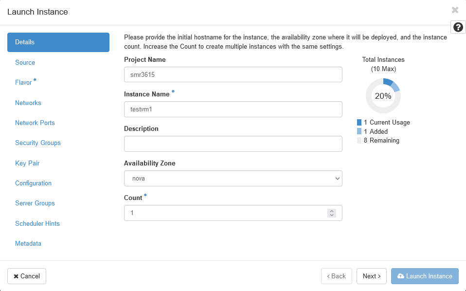

# Create A New Virtual Machine (VM) on the ICTP OpenStack Cloud

## Connect to the OpenStack API
   * Point your browser at https://osc2.ictp.it
   * Log in with the credentials sent via email
      * If you did not receive an email with a username, password, and domain please contact your instructor. 
      * The email will have come from the address clement.onime@ictp.it. He is the OpenStack administrator at ICTP. 
   * You'll be automatically presented with a pie chart visualization of the current status of your OpenStack environment. It will look something like the figure below, though it may differ. 
   

   * Click _Instances_ in the left-hand menu. This will show you all of the running instances. This may be empty if you are just starting. 
   * At the top-right of the screen you will have a _Launch Instance_ button. Click this button. 
   * A new popup window will open with the _Details_ of the VM you will be creating. 
      * The _Project Name_ field will be prepopulated.
      * Add an _Instance Name_. Call this something with your name or something you can uniquely identify, as other students' VMs may be listed here also. 
      * There is an optional _Description_ field. It is not necessary to add anything here, but you can if you want to.
      * The _Availability_ and _Count_ fields will be prepopulated. Be sure these are set to **nova** and **1**, respectively. 
      * It should look similar to this:
      
      * Click _Next_.
   * You will be automatically moved to the next tab in the popup _Source_.
      * **NOTE on Sources:** We will use Ubuntu. The following installation instructions are written in Python, R, and Jupyter.  If you are familiar with Debian or CentOS feel free to use it going forward, but you'll need to provide your own installation and configuration for the next exercises.
      * Choose the _Ubuntu Server 20.04_ option by clicking on the up arrow button to the right of the _Ubuntu Server 20.04_ line. It looks like this: . This will move the line from the _Available_ section to the _Allocated_ section of the popup window.   
      * Click _Next_.
   * You will be automatically moved to the next tab in the popup _Flavor_.
       * **NOTE on Flavors:** We will use a _m1.small_ VM for this default exercise. If you are importing your own data for this exercise and need additional compute power, talk to your instructor. We'll advise you on the availability of additional resources. 
       * Choose the _m1.small_ option by clicking on the up arrow to the right of the _m1.small_ option. This will move the line from the _Available_ section to the _Allocated_ section of the popup window.  
       * Click _Next_.
   * The _Network_, _Network Ports_, and _Security Groups_ are preconfigured by the OpenStack administrator. There is no need to adjust anything on these sections. 
       * Click on the _Key Pairs_ tab on the left side menu. 
   * In this step a public and private key will be created that will allow you to authenticate to the Virtual Machine you are creating. Keys may have been covered during the Security session in this class, but if not, see the brief explanation of Key Pairs at this [link](http://www.crypto-it.net/eng/tools/key-based-authentication.html). 
      *  **NOTE on Key Pairs:** If you have an existing key pair, you can use it here. Try the _Import Key_ option. However, for this exercise we will assume you need a new key pair and proceed with that assumption.
      *  **NOTE on Key Security:** DO NOT SHARE YOUR PRIVATE KEY. This is rule #1 of key security. You will get a public portion of the key that is sharable, but never share the private portion of your key. 
      *  Click the _+Create Key Pair_ button at the top of the screen. 
      *  Give your key pair a name in the _Key Pair Name_ box. I've used **ICTP_OpenStack_Key** to identify it from the other keys I manage. 
      *  Select _SSH Key_ from the _Key Type_ dropdown. 
      *  Click _Create Keypair_.
      *  You will be presented with a Private Key - copy it to your local machine using the _Copy Key to Clipboard_ option. 
      *  Write this key to a file on your local machine. This key will be needed later to access your Virtual Machine and install the software you'll use for an analysis.
   * The rest of the options do not need modification and you are ready to launch your Virtual Machine. 
      * Click _Launch Instance_. 
      * This will take a few minutes, but when it's active you'll see something like this:  
      * You have created a Cloud resource using OpenStack! Excellent work!
      * Write down the IP Address, you will need this along with your private key to do the next step.    

[Return to CI Overview](00-Hands_on_Exercise_Overview.md)
