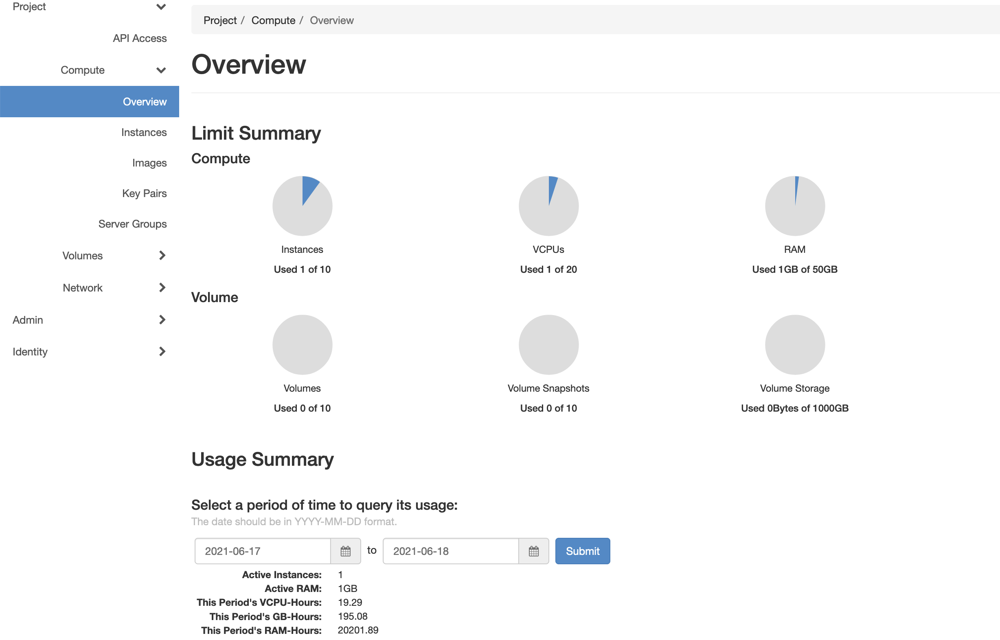
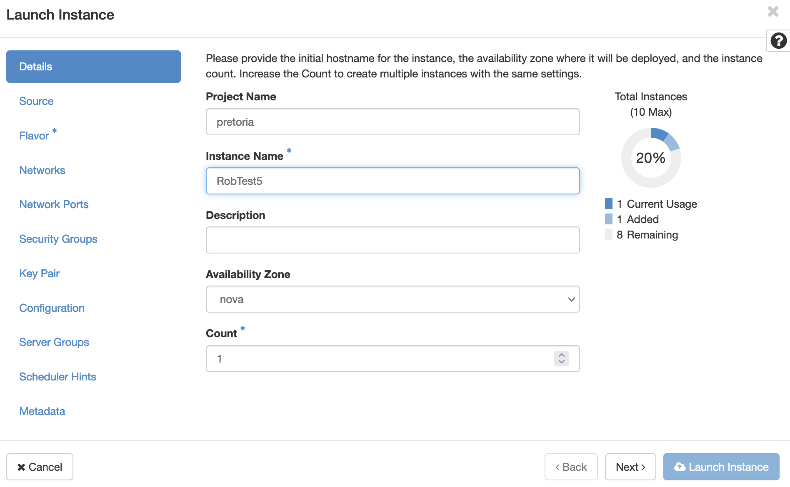

# Create A New Virtual Machine on the ICTP OpenStack Cloud

## Connect to the OpenStack API
   * Point your browser at https://osc2.ictp.it
   * Log in with the credentials sent via email
      * We'll need to work out how to distribute credentials for the actual school
   * You'll be automatically presented with a pie chart visulaization of the current status of your OpenStack environment. It will looks something like the figure below, though it may differ. 
   

   * Click _Instances_ in the left hand menu. This will show you all of the running instances, this may be empty if you are just starting. 
   * At the right top of the screen you will have a _Launch Instance_ button. Click this button. 
   * A new popup window will open with the _Details_ of the VM you will be creating. 
      * The _Project Name_ field will be prepopulated.
      * Add an _Instance Name_. Call this something with your name or something you can uniquely indetify as other student VMs may be listed here also. 
      * There is an optional _Description_ field. It is not necessary to add anything here, but you can.
      * The _Avaliability_ and _Count_ fields will be prepopulated. Be sure these are set to **nova** and **1** respectively. 
      * It should look similar to this:
      
      * Click _Next_.
   * You will be automatically moved to the next tab in the popup _Source_.
      * **NOTE on Sources:** We will use Ubuntu as that is what I'm most familiar with and what the following instructions for installing Python, R, and Jupyter will be written in.  If you are familiar with Debian or CentOS feel free to use it going forward, but you'll need to provide your own installation and configuration for the next exercises.
      * Choose the _Ubuntu Server 20.04_ option by clicking on the up arrow button the the right of the _Ubuntu Server 20.04_ line. It looks like this: . This will move the line from the _Available_ section to the _Allocated_ section of the popup window.   
      * Click _Next_.
   * You will be automatically moved to the next tab in the popup _Flavor_.
       * **NOTE on Flavors:** We will use a _m1.small_ VM for this default exercise. If you are importing your own data for this exercise and need additional compute power, talk to your instructor. We'll advise you on the availability of additional resources. 
       * Choose the _m1.small_ option by clicking on the up arrow to the right of the _m1.small_ option. This will move the line from the _Available_ section to the _Allocated_ section of the popup window.  
       * Click _Next_.
   * The _Network_, _Network Ports_, and _Security Groups_ are preconfigured by the OpenStack adimistrator. There is no need to adjust anything on these sections. 
       * Click on the _Key Pairs_ tab on the left side menu. 
   * In this step will will create a public and private key that will allow you to authenticate to the Virtual Machine you are creating. Keys may have been covered during the Security session in this class if not see the brief explanation of Key Pairs at this [link](http://www.crypto-it.net/eng/tools/key-based-authentication.html). 
      *  **NOTE on Key Paris:** If you have an existing key pair, you can use it here. Try the _Import Key_ option. However, for this exercise we will assume you need a new key pair and proceed with that assumption.

   
