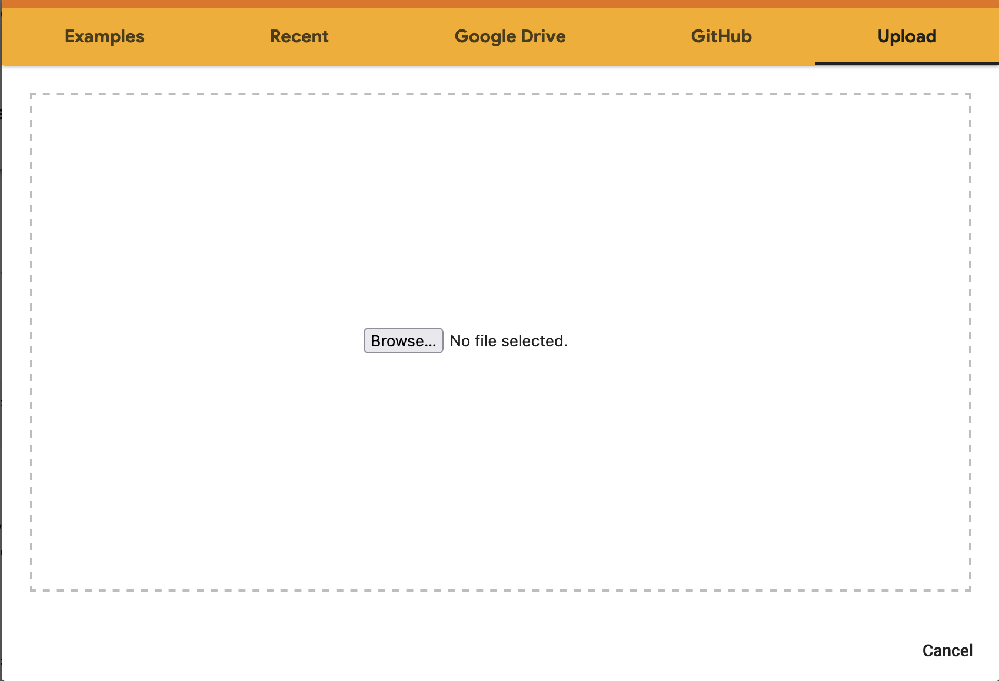

# Apache Spark on Google Colab

Google Colaboratory (Colab) allows notebooks execute code on Google's cloud servers, meaning you can leverage the power of Google hardware, including GPUs and TPUs, regardless of the power of your machine. 

We are going to use this free cloud resource to run a regression analysis on a common open data set that describes housing data in the Boston, US area. 

## Log Onto Google Colab

   * Point your browser at the [Google Colab](https://colab.research.google.com) site.
   * If you are not signed in use the _Sign In_ button on the top right of the screen. 
   * You will be presented with a pop up box that allows importing a file or starting a new file. Hit the _Cancel_ button and take some time to read the _What is Coloaboratory?"_ document. 
   * Once you have an general understanding of what Colab is, open a new file from the _File_ menu. 
   * You will see a pop up that looks like this:
   
   * Click the _GitHub_ link on the top bar menu.

## Start a Jupyter Notebook

## Import Code from GitHub

## Run Regression Analysis
